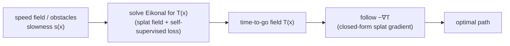

# Why Splats for Path Planning — Theory & Method

This note is the "why" and the "how" behind the project: why a **Splat Regression
Model (SRM)** is a good representation for motion planning, why planning routes
through the **Eikonal equation**, and the method we use to solve it. Measurements
and the experimental record live in [`investigation.md`](investigation.md).

---

## 1. What a splat model is

A splat model represents a function as a weighted sum of transformed bumps:

```
f(x) = Σ_j  V[j] · det(A[j])⁻¹ · ρ( A[j]⁻¹ (x − B[j]) )
```

Each splat `j` is a mother density `ρ` (default: standard Gaussian) that has been

- **moved** to a center `B[j]`,
- **stretched / rotated** by a matrix `A[j]` (full `[d,d]`, so anisotropic + tilted),
- **scaled in height** by `V[j]` (can be negative),
- **normalized** by `det(A[j])⁻¹`.

With `ρ` Gaussian the exponent is `−½ (x−B)ᵀ (A Aᵀ)⁻¹ (x−B)`, so **`A` is a square
root of the covariance** `Σ = A Aᵀ`. Training slides, grows, rotates, and re-weights
the blobs by gradient descent until their sum matches the target.

> **3D Gaussian Splatting is a special case:** fix `d=3`, `ρ=Gaussian`, constrain
> `A = R·S`, set `V = (opacity, SH-colour)`, and read out with the volume-rendering
> integral. SRM keeps all of these free — any dimension, any mother density, a free
> affine `A`, and **any differentiable readout**. Planning is simply a new readout (a
> PDE residual) on the same representation.

---

## 2. Splat vs. MLP — why this representation

Both are universal approximators, so this is not about what is representable; it is
about *how the function is built*.

| | **Splat (SRM)** | **MLP** |
|---|---|---|
| Basic unit | a **localized** bump at a location | a **global** ridge `σ(wᵀx+b)` |
| One parameter controls… | the function *in one region* | the function *everywhere* |
| Adding detail | move / drop a splat where needed | re-tune interacting weights globally |
| Derivatives (∇f, ∇²f) | **closed form**, smooth | autodiff; prone to spectral bias |

```
 SPLAT field: sum of local bumps          MLP unit: one global ridge
    ∧      ∧          ∧                        ________
   ╱ ╲    ╱ ╲   ╱╲   ╱ ╲                      ╱   active half-space
  ╱   ╲  ╱   ╲ ╱  ╲ ╱   ╲            ────────╱   (extends across ALL x)
 ╱     ╲╱     V    V     ╲          .........  wᵀx+b = 0
```

Three consequences matter for planning:

1. **No interference.** Nudging one splat changes `f` only locally, so credit
   assignment is clean ("this region is wrong → move the splats near it").
2. **Adaptivity.** Unlike fixed-grid RBF/Fourier bases, splats learn their centers
   `B` and shapes `A`, so they migrate to where the field is hard and spread where it
   is smooth.
3. **Cheap exact derivatives.** Planning follows `∇T`; splats give it analytically and
   smoothly, no grid, no autodiff noise.

---

## 3. Planning as a value function

We never model the path directly. We model a **value function** and read the path
off it. Let `T(x)` be the **time-to-go** from `x` to the goal. It obeys the **Eikonal
equation**

```
|∇T(x)|_g = s(x),      T(goal) = 0
```

where `s(x)` is the **slowness** (`1/speed`) and `‖·‖_g` is the norm in the domain's
metric `g`. The optimal trajectory is steepest descent on `T`:

```
ẋ = − ∇T / |∇T|
```

So "model paths with splats" means: **represent the scalar field `T` as a splat field,
solve the Eikonal PDE for it, then follow `−∇T`.** The loss is **self-supervised** —
there is no labelled `T`; we enforce the PDE residual and the source condition.



---

## 4. Two intrinsic properties that shape the method

**(a) The cut-locus kink.** The viscosity solution of the Eikonal is non-smooth: it
develops a sharp ridge along the **cut locus** (points reachable by two equally short
routes — e.g. behind an obstacle where two wavefronts collide).

```
        wavefronts →   ) ) )              ( ( (   ← wavefronts
  GOAL ●   ) ) )     [  OBSTACLE  ]     ( ( (
                    ⌇ ⌇ ⌇ ⌇ ⌇ ⌇ ⌇
                 cut locus (T is KINKED here)
```

A smooth field can only approximate the kink, so accuracy is naturally lowest there.

**(b) Slope, not level.** The Eikonal residual constrains only the *magnitude of the
gradient*, `|∇T|_g = s`. Infinitely many fields satisfy this pointwise; only the
**minimum-time (viscosity) solution** is correct. Selecting it requires *causal*
information — the value at a point is set by *integrating* slowness along the optimal
route back to the source. Where that route must wrap around an obstacle, the correct
**level** is not pinned by the local residual at all. This is the central difficulty
and it drives two design choices below (§6 causal weighting, §7 the prior).

---

## 5. The field — a factored splat value function

Write the field as a known base times a splat correction, so the source condition and
the free-space structure are built in rather than learned:

```
 T(θ) = base(θ) · correction(θ),      T(start) = 0   since base(start) = 0
```

- **`base(θ)`** is a known, cheap estimate of the time-to-go (the free-space geodesic
  `‖wrap(θ−start)‖`, or the obstacle-aware roadmap of §7).
- **`correction(θ)`** is the splat's job. Two forms:
  - `correction = 1/τ`, `τ = τ_min + (1−τ_min)·σ(splat) ∈ [τ_min, 1]`. Because `τ ≤ 1`
    this enforces `T ≥ base` **by construction** — the field can never beat the
    free-space distance — while `τ→τ_min` lets `T` rise sharply near obstacles; the
    floor `τ_min` keeps `T` bounded.
  - `correction = exp(splat)` — a small ± log-adjustment used when `base` is already
    accurate (`exp(0)=1` at init, so `T ≈ base`).

The metric enters only through the residual and the base, so a curved or anisotropic
metric plugs in without changing the placement: splats live in angle space and are
evaluated at the wrapped displacement `wrap(θ−B)` (the flat-torus log map).

---

## 6. The loss — a symmetric speed-match with causal weighting

**Speed-match residual.** The metric Eikonal is `‖∇T‖_{g⁻¹} = s`. Define the ratio of
achieved to required slowness and penalise it symmetrically:

```
 q(θ) = ‖∇T‖_{g⁻¹} / s = √( ∇Tᵀ · g⁻¹ · ∇T ) / s
 ℓ(θ) = q + 1/q − 2            (≥ 0, zero iff q = 1)
```

`ℓ` is bounded, symmetric in over/under-prediction, and — using `√` rather than the
squared form `(‖∇T‖²/s² − 1)²` — well-conditioned: it does not let high-slowness
obstacle points dominate the free-space bulk.

**Causal (near-to-far) weighting.** To select the minimum-time solution (§4b), fit
points in order of increasing distance from the source: a point is up-weighted only
once its upstream (nearer) neighbours already satisfy the residual.

```
 wᵢ = exp( −rate · Σ_{j nearer than i} gateⱼ ℓⱼ ) · gateᵢ ,     L = Σ wᵢ ℓᵢ / Σ wᵢ
```

`gate(θ) = σ(sdf/w)` (≈ 0 inside obstacles) excludes the irrelevant blocked interior;
`rate` anneals to 0 so the full residual is enforced by the end.

**Progressive obstacles and adaptive sampling.** Anneal the obstacle contrast
`s_λ = 1 + λ(s−1)`, `λ: λ₀→1` (start from the easy near-free problem and harden), and
draw collocation points with density `∝ (|ℓ|/mean|ℓ| + c)` (residual-adaptive) times a
source-outward frontier times an obstacle-rim boost — concentrating samples where the
residual is high and where the field is hard.

---

## 7. Pinning the level — a soft-min prior the Eikonal refines

By §4b the residual fixes the field's slope but not its level behind obstacles, so a
prior is needed to supply the level there. We build one that is **mesh-free** (hence
usable in high dimensions, unlike a grid solver) from a sampling planner.

**The roadmap base.** Grow an RRT\* tree from the source; each node carries its
cost-to-come (path length weighted by slowness, i.e. its Eikonal time). For a query θ,

```
 base(θ) = soft-min_i ( cost_i + slowness-weighted ‖wrap(θ − node_i)‖ )
```

— the cost to reach θ by hopping onto the best tree node and travelling the last leg,
with that leg weighted by the mean slowness along it (so legs through obstacles are
penalised). The soft-min (`−γ·logsumexp(−·/γ)`) makes `base` smooth and differentiable.

**Why this is the natural form.** Read a splat field's soft-min limit: for
`T = −γ log Σ exp(−dᵢ/γ)`, as `γ→0`, `T → min_i dᵢ`. An optimal value function *is* a
minimum of distances-to-wavefronts, so a **soft-min of local (anisotropic) distance
charts is exactly the shape of a time-to-go field.** Each tree node is one chart; the
soft-min stitches them.

**The Eikonal refines the prior.** A sampling planner returns *suboptimal upper
bounds* (finite samples ⇒ paths cost slightly too much). The field is regularised
toward this base (`base_reg·mean(splat²)`) but the speed-match residual (§6) is free to
pull it **down toward the true optimum** — so the trained field is more optimal than the
base it started from. The correction is small and local, which is what keeps the splat
well-conditioned and the method mesh-free end-to-end.

```
        base alone (rough)               after Eikonal refinement
      slightly-too-high, kinky            optimal, smooth, exact ∇T
```

---

## 8. Lifting to manifolds — tangent splat + exponential map

The end goal is planning on a Riemannian manifold `(M, g)` — e.g. an `n`-joint arm,
whose configuration space is the `n`-torus with the kinetic-energy (inertia) metric
`M(q)`. A splat is Euclidean, so we anchor it in a **tangent space** and evaluate it at
the **Riemannian log map**:

```
        tangent plane  T_pM  (Euclidean, splat lives here)
        ┌───────────────────────┐
        │        ∧  splat       │        exp_p : T_pM → M
        │       ╱ ╲             │   ───────────────────────►     ╱‾‾‾‾‾╲   M (curved)
        │   ──●─────────        │                               │  ●p    │
        │     p                 │                               │  splat │  wrapped onto M
        └───────────────────────┘                                ╲______╱
```

By **Gauss's lemma** `exp_p` is a radial isometry, so `|log_p(x)|_g = d_M(p, x)`:
geodesic distance in the tangent chart equals the chart's Euclidean distance. Hence a
tangent Gaussian becomes a *geodesic* distance chart, and the soft-min-of-distances
picture of §7 becomes a soft-min of **geodesic** distances — the correct manifold value
function. The metric `g` enters in exactly two places: the residual `√(∇Tᵀ g⁻¹ ∇T) = s`
and the log/exp maps. For the flat torus `g = I` and `log_p = wrap(· − p)`; swapping in
the arm's inertia metric `M(q)` makes the cost **anisotropic** (direction-dependent) —
a capability a scalar-speed model cannot express.

---

## 9. Summary

We plan by fitting a **value function** `T` (time-to-go), whose optimal paths are
`−∇T`. `T` is a **factored splat field** `base(θ)·correction(θ)` with the source
condition built in (§5). It is trained self-supervised with a **symmetric speed-match
Eikonal loss** under **causal (near-to-far) weighting** and progressive obstacles (§6).
Because the residual fixes slope but not level behind obstacles (§4b), a **mesh-free
soft-min prior from a sampling planner (RRT\*) supplies the level, and the Eikonal
refines it toward the optimum** (§7) — a soft-min of local distance charts being
exactly the form of an optimal value function. Splats live in tangent spaces and are
pushed to manifolds by the exponential map, so the same method covers curved domains
and anisotropic costs (§8). The flat 2-torus is the base case; the sphere is the first
curved check; the `n`-joint arm with its inertia metric is the target.
